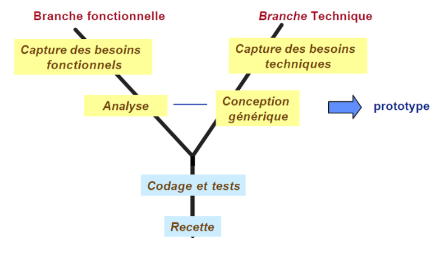

## 1- Processus de devloppement : 

### 1.1- Method  2-tap : 
2TUP est un processus de développement logiciel qui implémente le Processus Unifié.

#### Il commence par une étude préliminaire qui consiste essentiellement :
- identifier les acteurs qui vont interagir avec le système à  construire
- cahier des charges 
- modéliser le contexte

#### Le processus s'articule ensuite autour de 3 phases essentielles:
1. une branche technique
2. une branche fonctionnelle
3. une phase de réalisation

Branche fonctionnelle qui consiste en la modélisation et le maquettage pour clarifier les besoins fonctionnels.

Branche Technique qui recense toutes les contraintes à respecter pour réaliser le système Elle définit ensuite les composants nécessaires à la construction de l’architecture technique
La phase de réalisation consiste à réunir les deux branches, permettant de mener une conception applicative et enfin la livraison d'une solution adaptée aux besoins. Arrive par la suite l’étape de codage et enfin l’étape de recette, qui consiste à valider les fonctions du système développé.

### 1.2- les etapes de Conception : 
