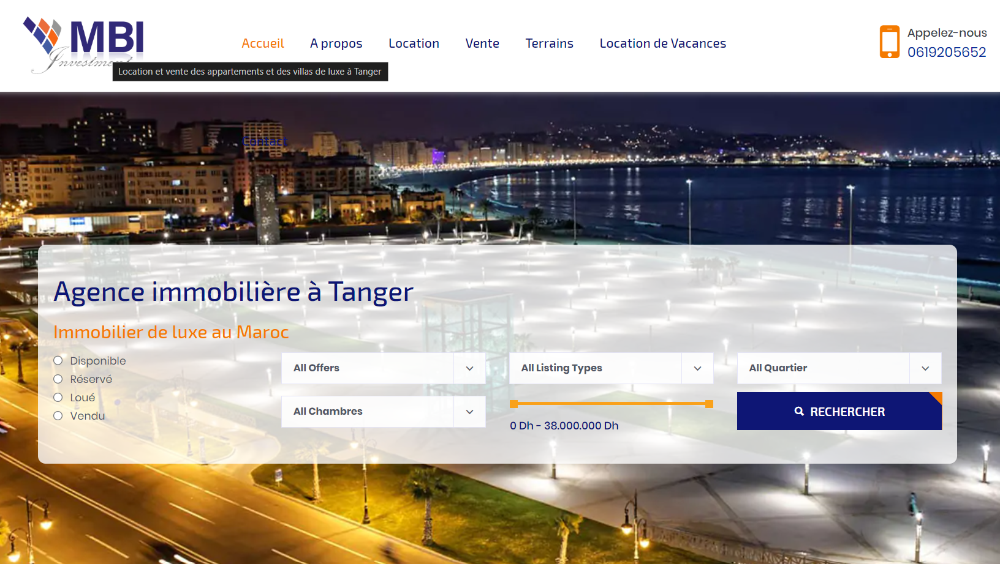

## 2- Analyse et planification

### 2.1 - Définition des objectifs :

Développer un site web de base pour une agence immobilière fictive située au Maroc.

### 2.2 - Identification du public cible :

Le site web de cette agence immobilière fictive sera utilisé par des personnes au Maroc cherchant à acheter, vendre ou louer une maison ou un appartement. Les utilisateurs pourront consulter les annonces et obtenir des détails sur les biens disponibles. Le but est de leur permettre de trouver facilement des maisons ou des appartements qui les intéressent et de contacter l'agence pour plus d'informations, tout cela grâce à une navigation simple sur le site.

### 2.3 - Étude de la concurrence :
#### 1- ***Identification des concurrents***
- Agence A :Vitalic Immobilier

 

- Agence B :MBI Invest

 

#### 2- ***Analyse des concurrents***

**a. Produits et services**
- Agence A : Offre des appartements, villas, et terrains à vendre et à louer.

- Agence B : Propose une variété de biens résidentiels et commerciaux à Tanger.

**b. Canaux de distribution**

- Agence A : Présence en ligne forte avec une interface utilisateur facile à naviguer.

- Agence B : Annonces en ligne et options de contact direct via le site.

#### 3- ***Conclusion***

Après avoir étudié la concurrence, nous avons décidé d'ajouter un filtre simple qui permet aux utilisateurs de choisir entre les appartements à louer ou à acheter. Cela rendra la recherche plus rapide et plus facile pour les clients.

### 2.4 - Cahier des charges :

**Objectif :** Créer un site web simple pour une agence immobilière.

**Fonctionnalités :**
* Page d'accueil avec présentation de l'agence et des services
* Page "À propos" avec informations sur l'agence
* Formulaire de contact pour les clients
* Section pour afficher les propriétés disponibles

**Design :**
* Design moderne et attractif
* Facile à naviguer
* Responsive pour s'adapter à différents appareils

**Technologie :**
* Utiliser le framework Laravel
* Pas besoin de base de données pour ce projet simple

**Délai :**
* Développer le site dans un délai de 1 semaine.
