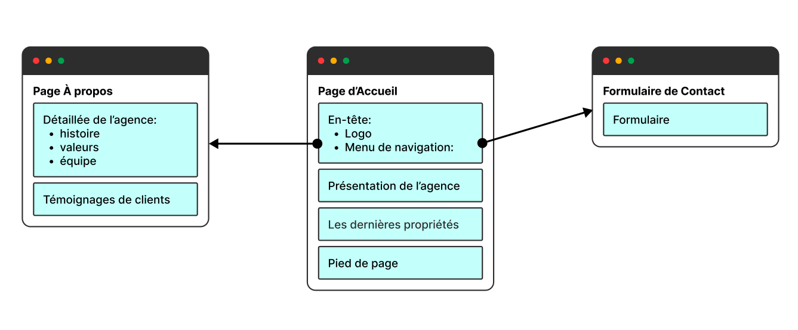

## 3. Conception de l'architecture du site

### 3.1 - Structuration du contenu :
La structuration du contenu est importante pour le site web. Elle aide à organiser les sections et à placer les éléments clés pour l'agence immobilière fictive.

### 3.2 - Création d'un plan du site ( SiteMap ) :
#### Page d’Accueil :

- En-tête personnalisé avec le logo de l’agence et un menu de navigation simple (À propos, Contact).
- Section de présentation de l’agence et de ses services.
- Section mettant en avant les dernières propriétés (simulées avec des données statiques).
- Pied de page avec les mentions légales, les coordonnées de l’agence et les réseaux sociaux.
#### Page “À propos” :
- Présentation détaillée de l’agence : histoire, valeurs, équipe.
Témoignages de clients (simulés).
#### Formulaire de Contact :
- Formulaire simple permettant aux utilisateurs d’envoyer un message à l’agence.
- Validation côté serveur des champs du formulaire.
- Envoi de l’email à une adresse prédéfinie.

